<h1 align="center">Co:Lab</h1>

Мобильное iOS-приложение для совместной работы: общения в чатах, поиска друзей и командного решения поставленных задач.

Для экранов приложения используется архитектурный паттерн <strong>Clean Swift (VIP)</strong>.
Основные технологии: <strong>UIKit</strong>, <strong>Firebase Auth/Firestore</strong>, <strong>Supabase Storage</strong>, <strong>Swinject</strong>.  
Дизайн приложения: <a href="https://www.figma.com/design/1RWtVVPEZfBwMCkfKoUGBm/Untitled?node-id=0-1&amp;p=f" target="_blank">Figma</a>  

<table align="center">
  <tr>
    <td align="center">
      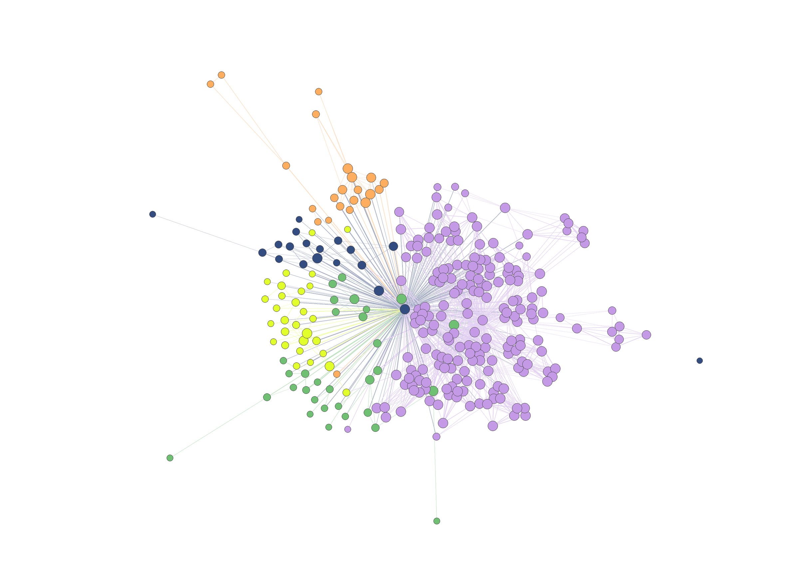 
      Диаграмма классов
    </td>
  </tr>
</table>

<h2 align="center">Скриншоты приложения и его функционала</h2>

<table align="center">
  <tr>
    <td align="center">
       
      Начальный экран
    </td>
    <td align="center">
      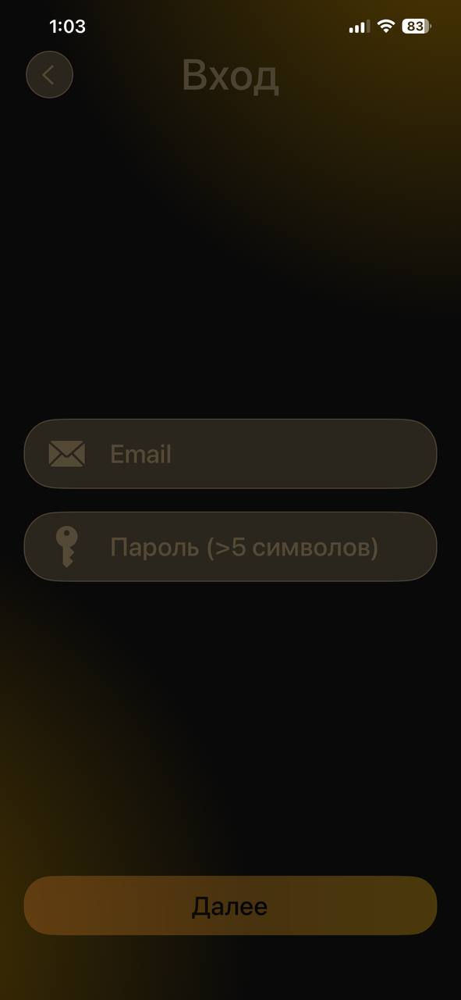 
      Экран входа
    </td>
  </tr>
</table>

<table align="center">
  <tr>
    <td align="center">
      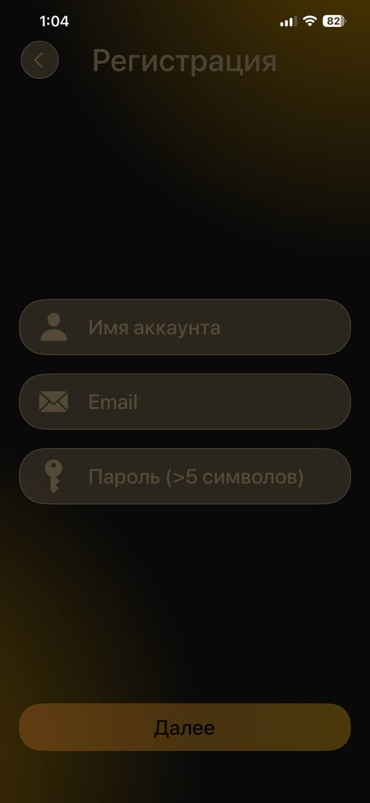 
      Экран регистрации
    </td>
    <td align="center">
      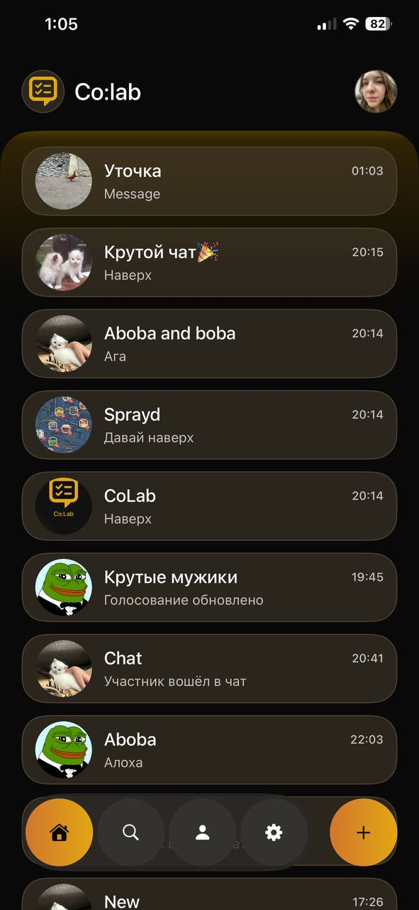 
      Список чатов
    </td>
  </tr>
</table>

<table align="center">
  <tr>
    <td align="center">
      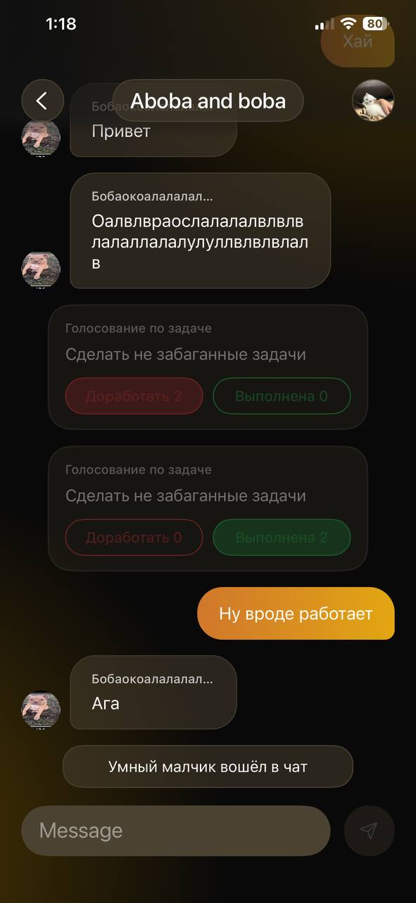 
      Экран переписки
    </td>
    <td align="center">
      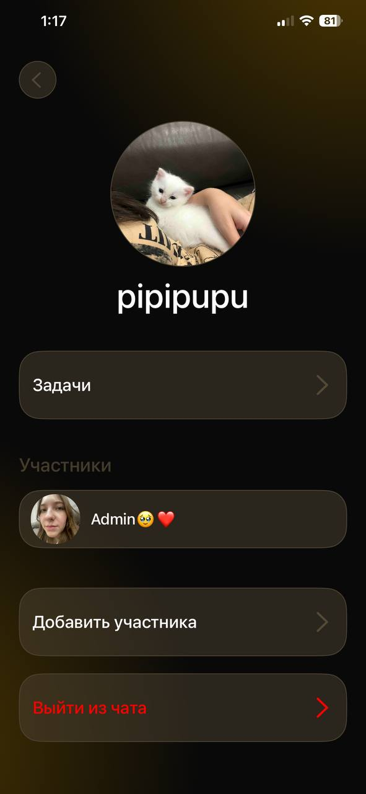 
      Информация о чате
    </td>
  </tr>
</table>

<table align="center">
  <tr>
    <td align="center">
       
      Экран задач чата
    </td>
    <td align="center">
      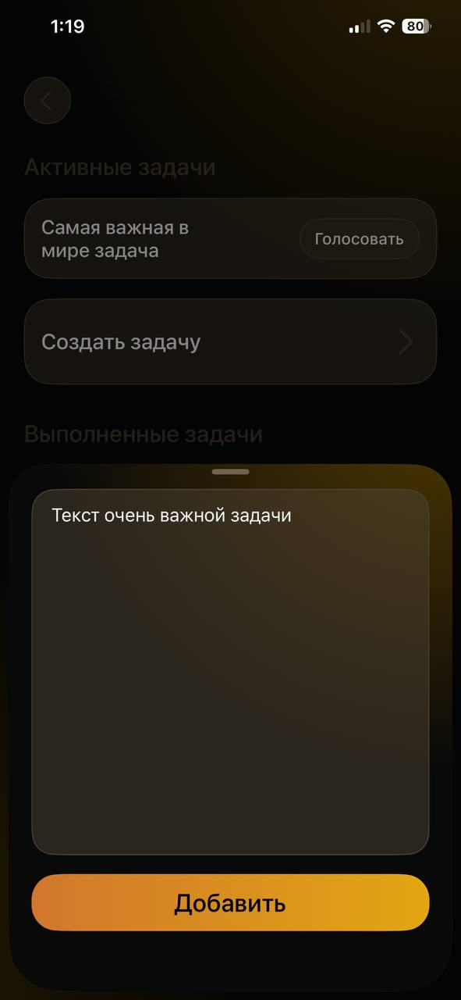 
      Создание задачи
    </td>
  </tr>
</table>

<table align="center">
  <tr>
    <td align="center">
      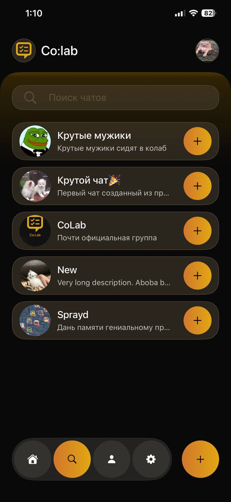 
      Поиск чатов
    </td>
    <td align="center">
      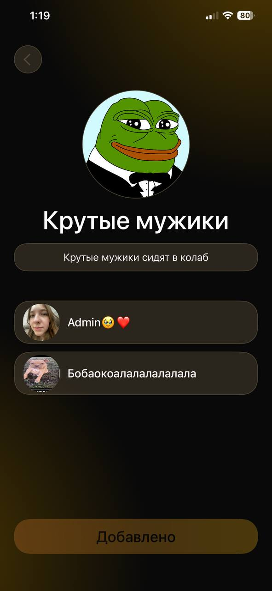 
      Карточка найденного чата
    </td>
  </tr>
</table>

<table align="center">
  <tr>
    <td align="center">
      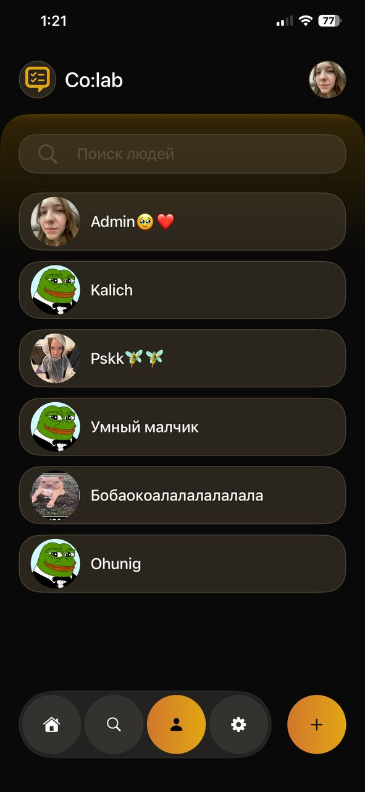 
      Раздел поиска друзей
    </td>
    <td align="center">
       
      Профиль пользователя
    </td>
  </tr>
</table>

<table align="center">
  <tr>
    <td align="center">
      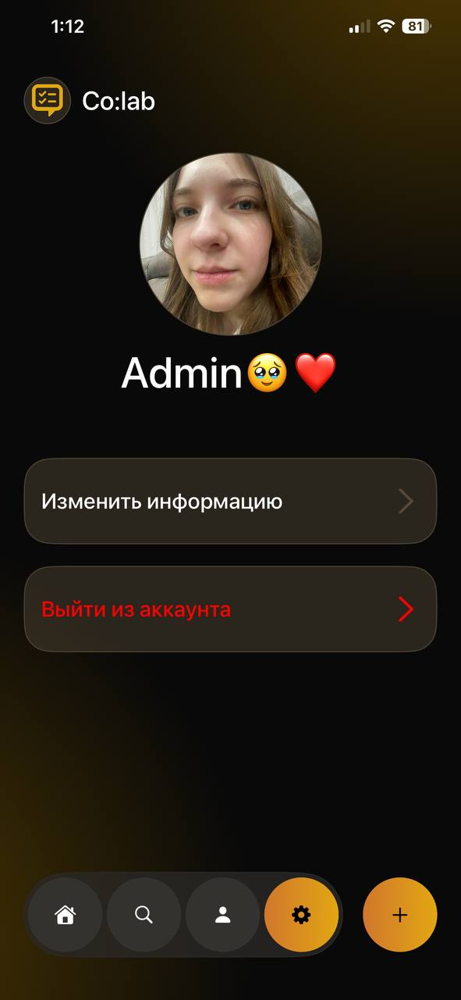 
      Экран настроек
    </td>
    <td align="center">
      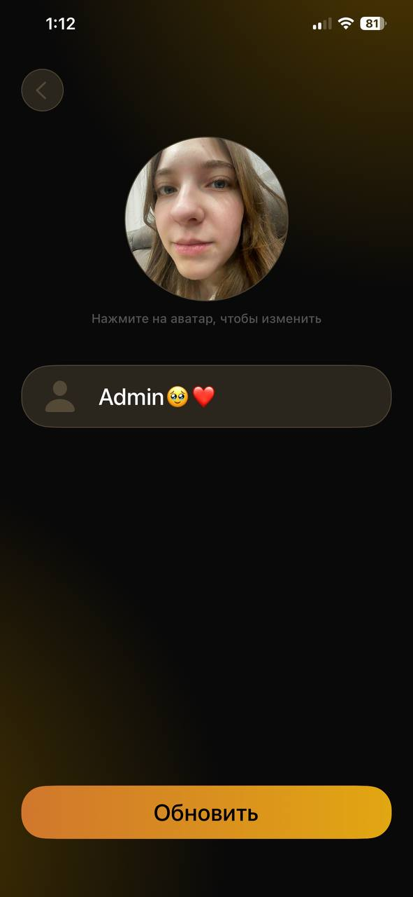 
      Редактирование профиля
    </td>
  </tr>
</table>

<table align="center">
  <tr>
    <td align="center">
      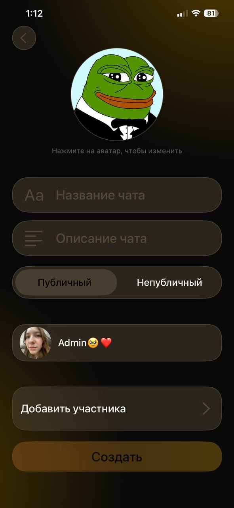 
      Создание чата
    </td>
    <td align="center">
      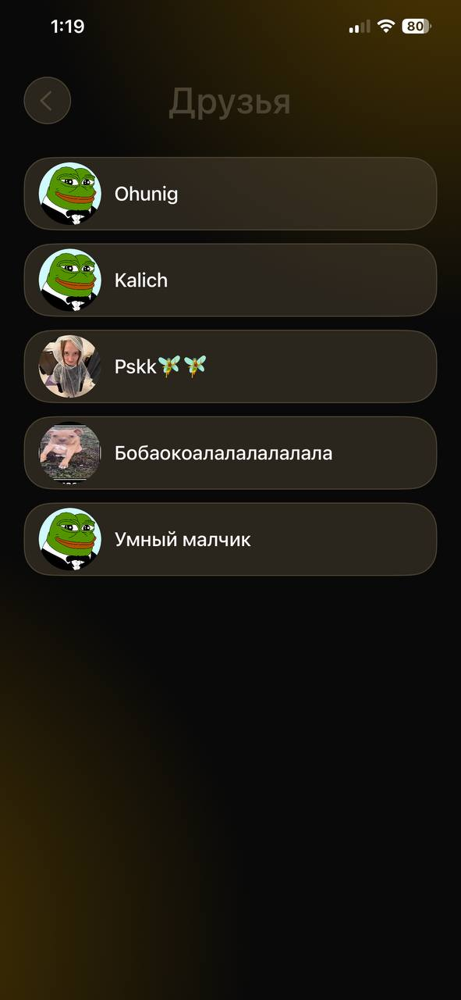 
      Выбор друзей
    </td>
  </tr>
</table>

<table align="center">
  <tr>
    <td align="center">
      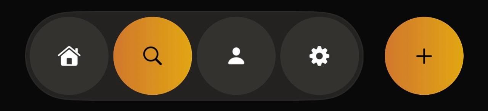 
      Кастомный таб бар
    </td>
  </tr>
</table>
